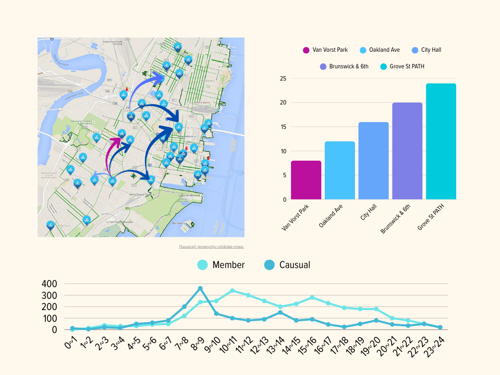
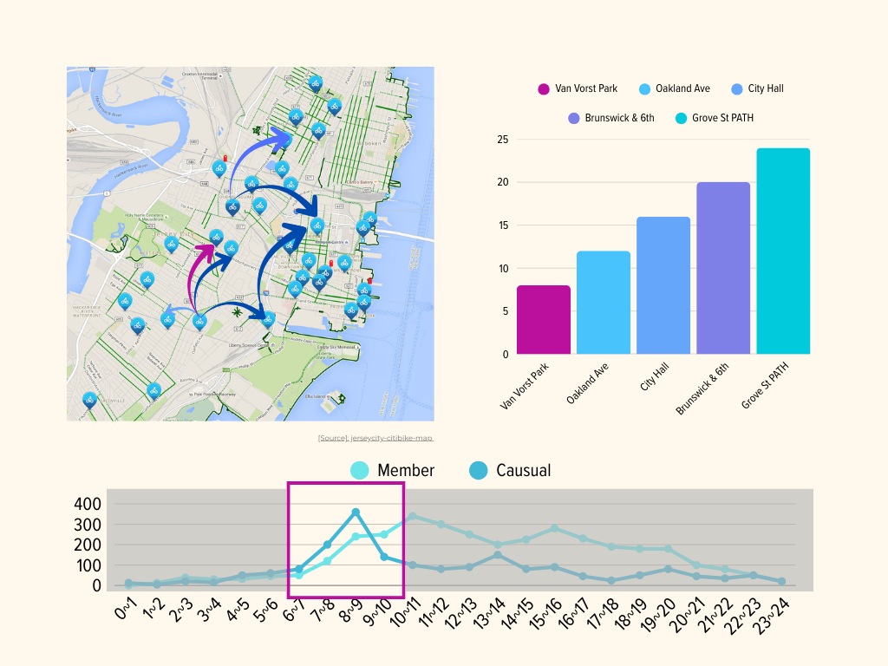
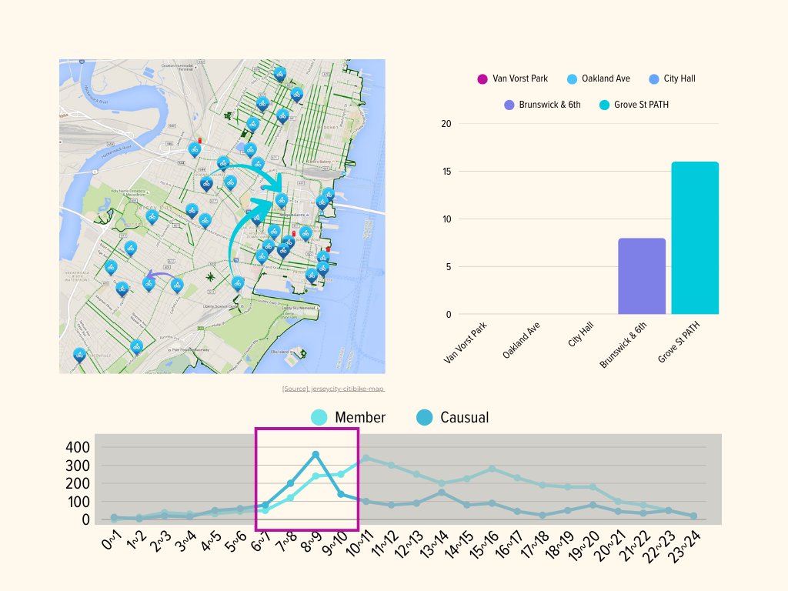
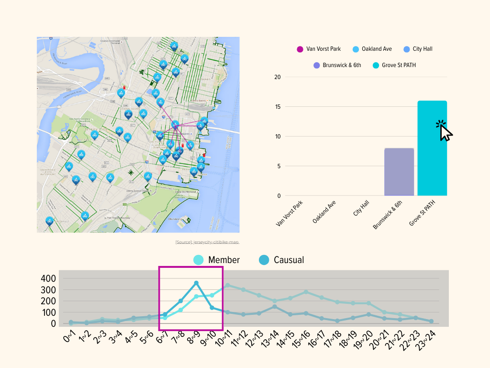

# **Prototyping Our Design**

> Prototyping Design for the Jersey City Citi Bike Analysis

<strong>Group:</strong> 11   
<strong>GitHub Repository:</strong> <a href="https://github.com/tsaichen1o/jc-citibike-vis">https://github.com/tsaichen1o/jc-citibike-vis</a>

Our dashboard will follow the rule: Overview first, zoom and filter, details on demand.

-   Center: A Geographic Map of Jersey City (Spatial).
-   Bottom: A Time-Series Chart (Temporal & filtering).
-   Side: A Ranking Chart (Details & filtering).

### Task 1: Compare Distributions (Member vs. Casual Trends)

**Goal:** Understand how riding behavior differs between user groups over time.

-   **Design Option A (Stacked Area Chart):** A single stacked area chart over 24 hours, with Member and Casual rides stacked on top of each other to show the total volume.
    -   This makes the overall activity pattern easy to see, but it is hard to compare the two groups at a specific hour because their difference is not directly visible.
-   **Design Option B (Baseline):** Superimposed Multi-Line Chart
    -   **Idiom:** A line chart with two lines plotted on the same axes.
    -   **Marks:** `Lines`.
    -   **Channels:**
        -   `Position (Vertical)`: Number of trips (Magnitude).
        -   `Position (Horizontal)`: Time of day (0-24h).
        -   `Color Hue`: User type (e.g., Blue for Member, Orange for Casual).
    -   **Interaction 1: Explore (Overview + Detail) Brushing.**. The user can drag a selection box over a time range (e.g., 7-10 AM) to filter the Map and Bar Chart to reveal subsets.
    -   **Interaction 2: Lookup (Details on Demand). Hover/Tooltip**. Hovering over a specific hour line displays a tooltip with the exact ride count for both groups, facilitating precise lookup.
    -   Superposition allows for the most precise comparison of values. We can instantly see when casual riders might overtake members (e.g., weekends vs weekdays) or distinct commute peaks.
    -   **State:** The selected time range is highlighted (colored border box) on the chart. A text label (e.g., "Filter: 7:00 - 9:00") appears above the chart.
    -   **Success Check:** Users can identify the peak activity hour for casual riders without hovering. Changing the time brush updates all linked views in under 1 second.

### Task 2: Summarize Flows (OD Connectivity)

**Goal:** Identify major geographic routes. Since we lack GPS traces, we visualize direct Origin-Destination (OD) connections (1-hop), not street-level paths.

-   **Design Option A (Straight Line Connection):** Straight lines connecting start and end stations.
    -   In busy areas (like Grove St), many lines overlap and form a messy tangle, so it becomes hard to see the direction of each flow.
-   **Design Option B (Baseline):** Bundled Arc Map
    -   **Idiom:** A geographic map with curved links.
    -   **Marks:** `Lines` (Curved Arcs).
    -   **Channels:**
        -   `Width`: Number of trips on this route.
        -   `Opacity`: Make less-used routes more transparent so the map looks less crowded.
        -   `Curvature`: Use curved lines so similar routes bend together and form clear bundles.
    -   **Interaction 1: Explore (Overview+Detail). Linked Filtering**. The map automatically updates to show only flows corresponding to the time selected in Task 1.
    -   **Interaction 2: Browse (Navigate). Zoom & Pan**. Users can zoom into dense neighborhoods to split the bundles and see local connections more clearly.
    -   Curved lines help avoid too much overlap around central stations. Thicker lines highlight the main commuting routes and make them stand out from the rest.
    -   **State:** The map displays only the arcs relevant to the active time filter. The zoom level is indicated by the map scale.
    -   **Success Check:** The top 5 major commute corridors are visually distinguishable by line thickness. Zooming into a neighborhood reveals local connections without lag.

### Task 3: Rank Stations (Identify Top Hubs)

**Goal:** Identify the most popular start and end points.

-   **Design Option A (Word Cloud):** Station names sized by trip count.
    -   Visually interesting but poor for ranking tasks. The size will also be affected by the length of the stations, making comparison impossible.
-   **Design Option B (Baseline):** Ordered Bar Chart
    -   **Idiom:** Horizontal Bar Chart.
    -   **Marks:** `Lines` (Bars).
    -   **Channels:**
        -   `Length`: Total Trip Count.
        -   `Position (Vertical)`: Rank order (Ordinal).
    -   **Interaction 1: Locate (Highlighting). Selection**. Clicking a bar highlights that specific station on the Map (Task 2) to show its location context.
    -   **Interaction 2: Lookup (Search). Search Bar**. A text input allows users to type a station name (e.g., "Liberty") to immediately find and scroll to it in the ranking list.
    -   Aligned position and length are the most effective channels for comparing quantitative data. Horizontal alignment accommodates long station names.
    -   **State:** The unselected bar is shaded in a darker color. A "Sorted by Count" badge is visible.
    -   **Success Check:** The top 10 stations are completely visible without scrolling. Clicking a station highlights it on the map immediately.

### Task 4: Analyze Connectivity (1-Hop Neighborhoods)

**Goal:** Identify which stations act as central "hubs" and visualize their immediate connectivity range.

-   **Design Option A (Matrix View):** An adjacency matrix showing connections between all pairs of stations.
    -   With hundreds of stations, the matrix is huge and hard to read, and it no longer shows where stations are in the city.
-   **Design Option B (Baseline):** Node-Link Highlight (Star Plot on Map)
    -   **Idiom:** A spatial node-link diagram that focuses on a single selected node.
    -   **Marks:** `Points` (Stations) and `Lines` (Links).
    -   **Channels:**
        -   `Color Hue`: Distinguishes the selected "Origin" station from its connected "Destinations".
        -   `Line Width`: Flow volume to each specific destination.
    -   **Interaction 1: Explore (Overview+Detail). Click Selection**. Clicking a station on the map to isolate its "1-hop neighborhood"—showing only the direct links radiating from it, hiding all other background noise.
    -   **Interaction 2: Browse (Grouping). Toggle Direction**. A switch allows the user to change the view between "Incoming trips" (Where do people come from?) and "Outgoing trips" (Where do they go?).
    -   This design focuses on the "1-hop" connections only. Instead of a messy full network, it lets users see the connection pattern for one station and check if it is a local hub or connects to far-away stations.
    -   **State:** The selected station is highlighted (larger dot), and all unrelated links are hidden. A label shows the active direction mode (e.g., "View: Outgoing").
    -   **Success Check:** The 1-hop network for a selected station is clearly isolated on the map. Users can visually identify the strongest connection (thickest line) within 5 seconds.

 
\pagebreak

## Storyboard: Optimizing the Morning Commute

> User: BardiC (Urban Planner)  
> Goal: Determine if the current infrastructure supports the morning rush hour flow into the financial district.

**1. Overview**
BardiC opens the dashboard. She sees the Map showing flows for the entire month (messy) and the Line Chart showing the 24-hour cycle.

  

**2. Narrow Scope (Filtering)**
She notices a sharp spike in the "Member" line (Blue) on the Line Chart between 7:00 AM and 9:00 AM. She uses the Select tool to select this specific time window.

  

 
\pagebreak

**3. Inspect Details (Linked Update)**
The Flow Map automatically updates. The messy web of lines disappears, revealing thick arcs moving from residential areas (Hamilton Park) towards the transport hub (Grove St PATH). The Bar Chart reorders to show "Grove St" as the #1 destination.

  

**4. Capture Insight (Service Gaps)**
She clicks "Grove St" on the Bar Chart to isolate it. The map filters to show only the 1-hop connections for Grove St. She sees that while it receives traffic from everywhere, there is a missing link from a new residential development in the west, indicating a potential need for a new connecting bike lane.

  

