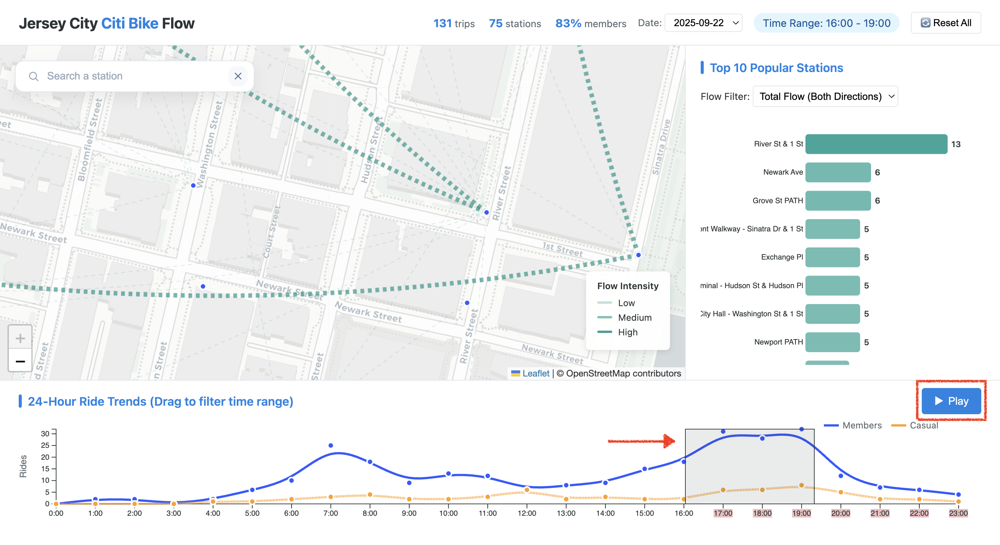
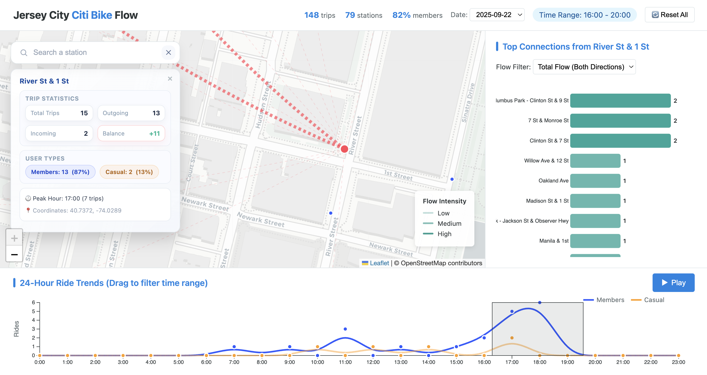
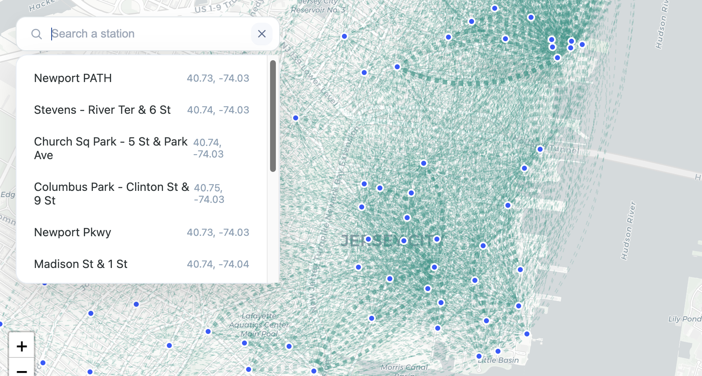
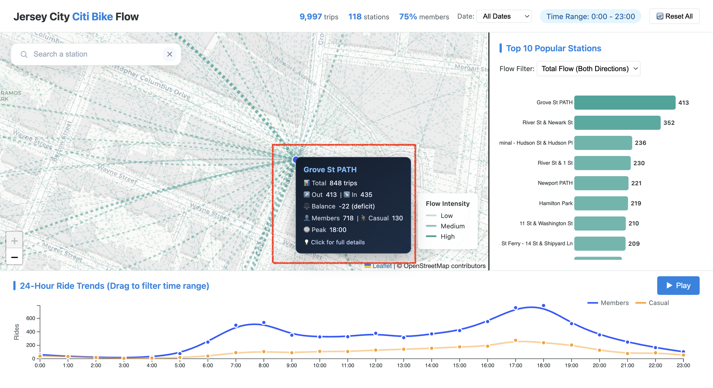
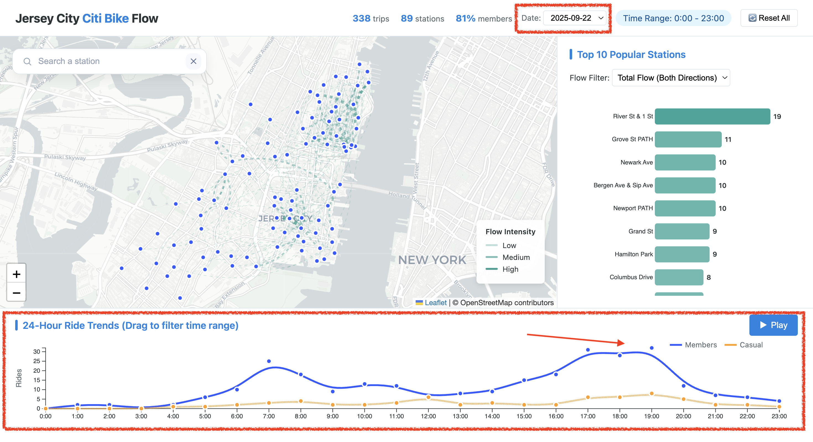
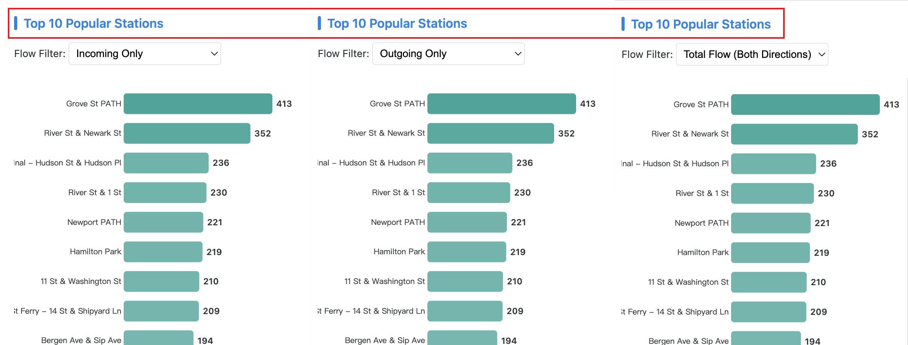
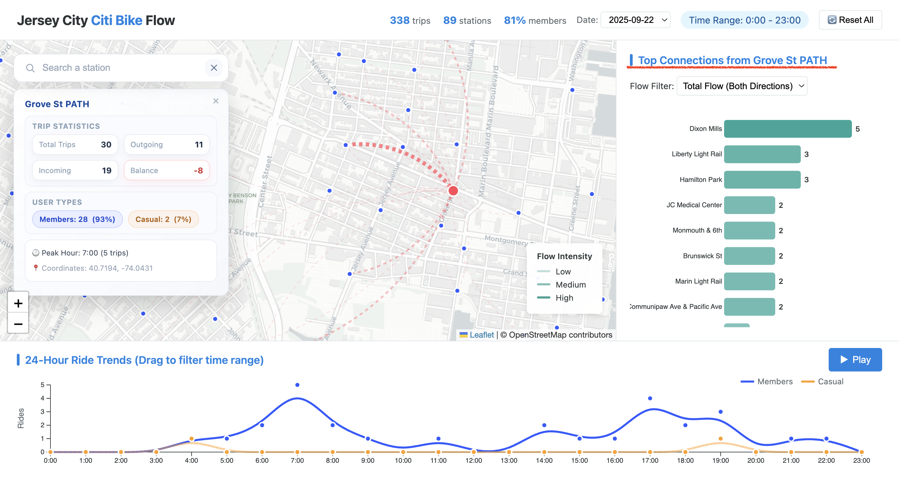
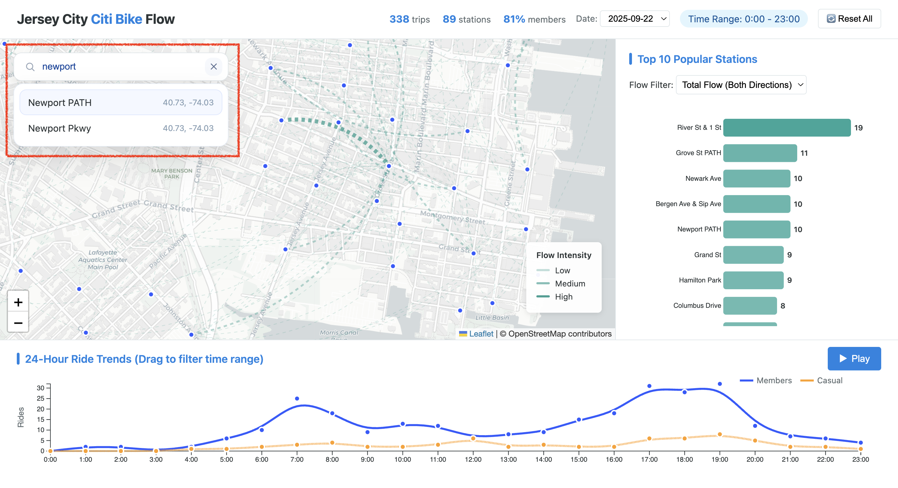
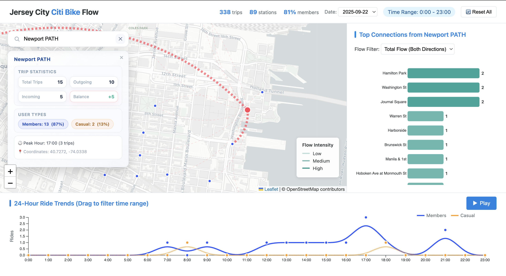

# **Implementation of Our Design**

> Jersey City Citi Bike Dashboard — From Blueprint to Demo-Ready System

<strong>Group:</strong> 11   
<strong>GitHub Repository:</strong> <a href="https://github.com/tsaichen1o/jc-citibike-vis">https://github.com/tsaichen1o/jc-citibike-vis</a>

The system follows the **Information Seeking Mantra**: _Overview first, zoom and filter, then details-on-demand_. The interface is structured into three coordinated zones:

- **Center:** A geographic map visualizing spatial flow.
- **Bottom:** A time-series chart for temporal trends and interactive filtering.
- **Side:** A dynamic ranking chart for station-level performance and connectivity analysis.

## 1. System Overview & Visual Encodings

Our implementation follows the design rules (Marks and Channels) to represent data effectively:

- **Spatial View (Map):** Station locations are encoded as `points`. Flows are implemented as `curved arcs` to reduce clutter. The `line width` and `opacity` represent trip volume (magnitude), making major routes stand out clearly.
- **Temporal View (Line Chart):** We use `vertical position` for trip counts and `horizontal position` for the time of day. To separate user types (Member vs. Casual), we use color hue (Blue and Orange), which is the most effective channel for categorical data.
- **Ranking View (Bar Chart):** We chose a horizontal bar chart because length and aligned position are the most precise channels for comparing numbers. This allows users to quickly see which stations are the most popular.

## 2. Implementation by Tasks

We focused our implementation on interactions that directly solve the user's core challenges, avoiding purely ornamental features.

### Task 1: Compare Distributions (Time Filtering)

- **Challenge:** Users need to isolate specific rush hours (e.g., 8:00 AM) to see how commute patterns change.
- **Implementation:** We implemented **Brushing** on the line chart and a **Play Animation** button.
- **Result:** Users can drag a selection box across the time-series chart or watch the daily flow evolve automatically to spot peaks.

  

### Task 2: Summarize Flows (Spatial Overview)

- **Challenge:** The raw data creates a messy "hairball" on the map, making it hard to see main routes.
- **Implementation:** We used **Curved Arcs** with opacity mapping and enabled **Zoom & Pan**.
- **Result:** Major commuting arteries are visually distinct. Zooming allows users to inspect dense areas without losing context.

  

### Task 3: Rank Stations (Lookup & Locate)

- **Challenge:** Finding a specific station among hundreds is difficult.
- **Implementation:** We added a **Search Bar with Auto-Complete**.
- **Result:** Users can type a name (e.g., "Grove") to instantly locate a station. The map automatically centers on it, and the station highlights in red.

  

### Task 4: Analyze Connectivity (1-Hop Context)

- **Challenge:** Users need to understand both the _network context_ (where do riders go?) and the _specific metrics_ (what is the exact volume?) of a station.
- **Implementation:** We implemented **Linked Filtering** and **Details-on-Demand** interactions.
- **Result:** Hovering over any visual mark reveals precise statistics via `tooltips`. Clicking a bar isolates that station's **1-hop neighborhood** on the map and expands a **detailed info panel** with balance metrics, effectively filtering out noise to focus on deep insights.

  

## 3. State & Coordination

To ensure the user never gets lost, we implemented a centralized state management system:

- **Linked Views:** All three views (Map, Line, Bar) are synchronized: selecting a station on the map or ranking list updates the entire dashboard. The line chart adapts to show that station's specific temporal profile, while the map filters to its "1-hop neighborhood" (direct connections).
- **Visual Feedback:**
    - **Active State:** When a station is selected, it turns Red and increases in size (radius).
    - **Inactive State:** Unselected elements fade out (reduced opacity) to make the active data pop out.
- **Global Reset:** A "Reset All" trigger ensures users can easily return to the initial overview state after exploring deep details.

## 4. Quality Bar (Self-Check)

Our implementation has been evaluated against the project requirements to ensure a high-quality user experience.

### Task Efficiency (≤ 3 Steps Principle)

We designed the dashboard so users can finish tasks quickly. All primary tasks require 3 or fewer actions:

- **Task 1 (Time Trends): 1 Step.** Users can see the peak hours immediately by looking at the line chart.

  

- **Task 2 & 4 (Connectivity): 2 Steps.** First, click a station (or search for it); second, look at the highlighted map lines.

  

When the user clicks the bar for **Grove St PATH**, the ranking view locks that station as the focus and the map immediately redraws the flows originating from that station.

  

- **Task 3 (Lookup): 2 Steps.** Type the name in the search bar and press enter.

  

Here we type **Newport PATH** in the search bar; the ranking list and map jump to that station and highlight its location.

  

### Effective Encodings

- **Position & Length:** We used the most accurate visual channels for our most important data. The **Bar Chart uses Length** to compare popularity, and the **Line Chart uses Vertical Position** to compare ride counts. This makes comparisons precise and easy.

### Robustness: Edge Cases & Data Quality

We specifically addressed potential data issues and layout challenges:

- **Data Outliers:** We filtered out trips with unrealistic durations (e.g., < 1 minute or > 24 hours). This ensures that our trends are not skewed by broken bikes or system errors.
- **Long Labels:** Jersey City station names can be very long (e.g., "Christopher Columbus Dr at..."). We used a **Horizontal Bar Chart** instead of a vertical one to ensure these names are readable and never cut off.
- **Data Scale:** To prevent information overload, we cap the ranking list at the Top 10. This ensures the UI remains clean even though the dataset contains hundreds of stations.

### Performance & Responsiveness

To ensure instant feedback (<200ms) even with large datasets, we implemented specific optimization strategies:

- **Data Aggregation (Binning):** We do not render raw trip data. Instead, the system dynamically aggregates thousands of individual trips into weighted station-to-station flows (arcs) and station counts. This drastically reduces the number of DOM elements the browser needs to render.
- **Efficient Data Binding:** We utilize D3’s **Enter-Update-Exit** pattern. When filtering, the system only modifies the DOM elements that actually change (e.g., updating bar lengths) rather than destroying and rebuilding the entire visualization tree.
- **Asynchronous Updates:** All view modifications are driven through an asynchronous `updateCharts` function. Even with thousands of data points, the filtering logic remains highly responsive, ensuring the UI does not hang during data processing.

### Accessibility & Clarity

We ensured the design is readable and accessible to a wide range of users:

- **Color Blindness Safe:** We chose Blue and Orange for the user groups. These colors are distinct not only in hue but also in luminance, making them distinguishable even for colorblind users or in greyscale mode.
- **Dynamic Titling:** The Bar Chart title changes to show context (e.g., "Top 10 Destinations from [Station Name]").
- **Instructional Cues:** The chart title explicitly says "Drag to filter," teaching users how to interact.

